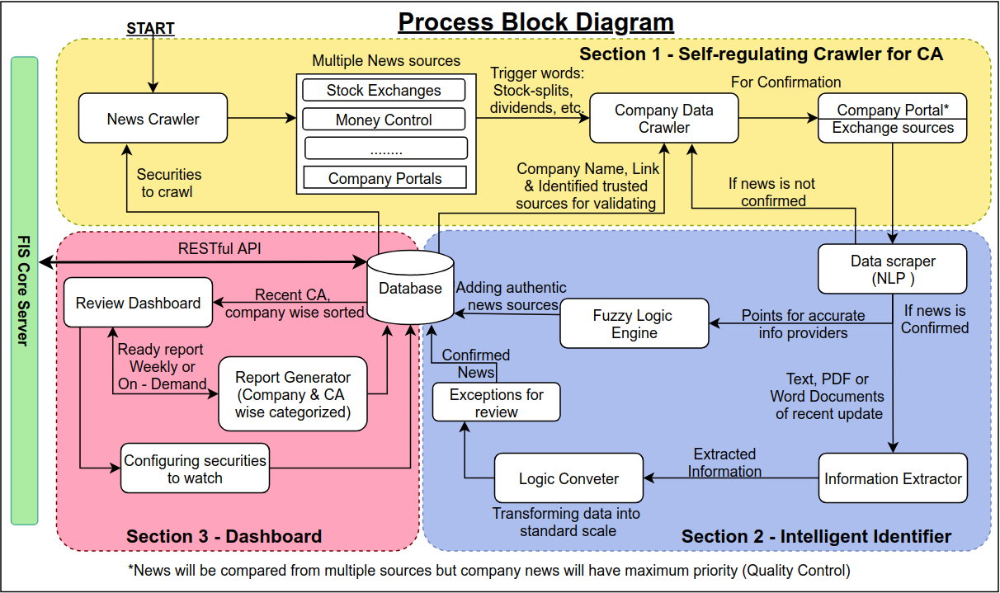

# SM445_PYTHANOS
Welcome to the master branch of team PYTHANOS! 

# Introduction
1. **Problem Statement No. - SM445**

2. **Team Name - PYTHANOS**

3. **Participant details:**

| Name                   | Institute                                | Mobile No. | Email ID                     |
| ---------------------- | ---------------------------------------- | ---------- | ---------------------------- |
| Prathamesh Nerkar      | FR. C. RODRIGUES INSTITUTE OF TECHNOLOGY | 8108800918 | prathameshn99@gmail.com      |
| Abhijit Acharya        | FR. C. RODRIGUES INSTITUTE OF TECHNOLOGY | 9867256109 | abhijit_acharya@outlook.com  |
| Suraj Mahangade        | FR. C. RODRIGUES INSTITUTE OF TECHNOLOGY | 9820871262 | surajmahangade9999@yahoo.com |
| Aishwarya Anna Mathew, | FR. C. RODRIGUES INSTITUTE OF TECHNOLOGY | 8108131266 | hello.ash99@gmail.com        |
| Ritoo Verma            | FR. C. RODRIGUES INSTITUTE OF TECHNOLOGY | 7021835514 | ritoov2@gmail.com            |
| Varad More             | FR. C. RODRIGUES INSTITUTE OF TECHNOLOGY | 9967438112 | varadmore1@gmail.com         |

4. **Mentor details:**

| Name               | Mobile No. | Email ID                      |
| ------------------ | ---------- | ----------------------------- |
| Saurav Panda       | 9167388937 | sauravgopinathpanda@gmail.com |
| Tanvi Rajadhyaksha | 9769919313 | rajadhyakshatanvi@gmail.com   |

5. **Problem Description**

Back Ground: A corporate action is an event initiated by a public company that will bring an actual
change to the securities—equity or debt—issued by the company. Corporate actions are typically agreed
upon by a company&#39;s board of directors and authorized by the shareholders. Examples of corporate
actions include stock splits, dividends, mergers and acquisitions, rights issues, and spin-offs. Corporate
action instantly impacts security valuation and hence its timely and accurate information is very critical
to financial institutes and investors. Information on current, upcoming, and historical corporate action
can be purchased from various data vendors like Bloomberg, ICE Data Service, Refinitiv, MarketMap, etc.
which could be expensive. Alternatively, data could be freely retrieved from public webpages and
company portal. Challenge with free data approach is its accuracy, reliability and completeness Problem
Statement: Goal of corporate action (CA) robot is to retrieve accurate, and complete information on
historical, current, and future expected corporate action in timely manner from free sources. Required
features:

1. Capability of crawling public web pages to retrieve information related to historical, current, and
future expected corporate action. Data could potentially be available directly on webpage or in form of
downloadable file (.pdf, .docx)
2. Ability of process information available in free text format like pdf, and MS word document
3. Intelligently identify context in which data is available, like is it listed as example, or is it a real
announced corporate action. We should also be able to classify CA as approved or yet to be approved
corporate action.
4. Extract important information from retrieved pages/files on corporate action like – Security Identifier
type (ISIN, CUSIP, Ticker, etc.), Identifier Value, corporate action type, Ex. Date, record date, pay date,
payment / ratio / other key information, other relevant corporate action details etc. Example: ISIN:
INE239A01016 Company: Nestle India Type of CA: Interim dividend Amount: Rs. 55 Ex Date: 11/12/2019
Rec Date: 12/12/2019 Pay Date: 02/01/2020
5. Build accurate, and complete data from conflicting data retrieved from multiple sources. It should
continuously learn about sources which could be trusted for specific information
6. Ability to configure to look for CA on a set of securities, to all listed securities on specific exchange.
7. Robot could be configured to continuously look for new data available for relevant corporate action.

# Resources

6. **Technology stack**

# Design

13. **Architecture Diagram:**

14. **Different data flows / pipelines:**

15. **AI /ML models used:**
16. **Data Scheme:**
17. **Algorithms Used:**

# Current Progress

18. **Data Source for corporate actions (CA)**
    - Whether configurable:
    - Source specific support?
    - Intelligent crawling:
    - Type of data gathered
    - Types of Documents supported
    - Schedule structure of data collection:
    - Technology/Tool used
19. **Data Extraction**
    - Method of Data Extraction
    - Data points Extraction capability of system
    - Types of documents successfully processed
    - Links of data processed and the extent
